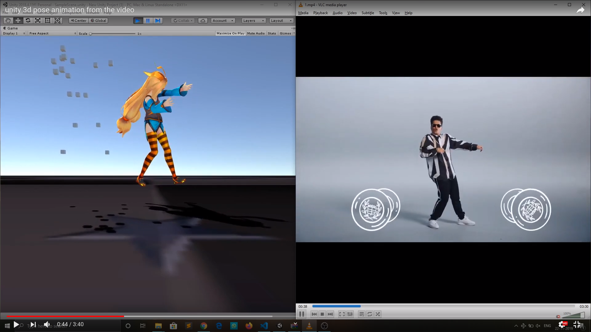
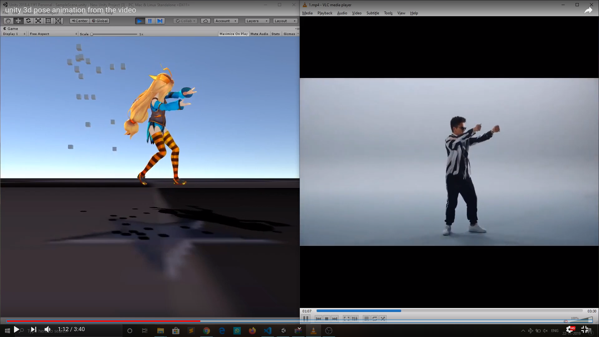
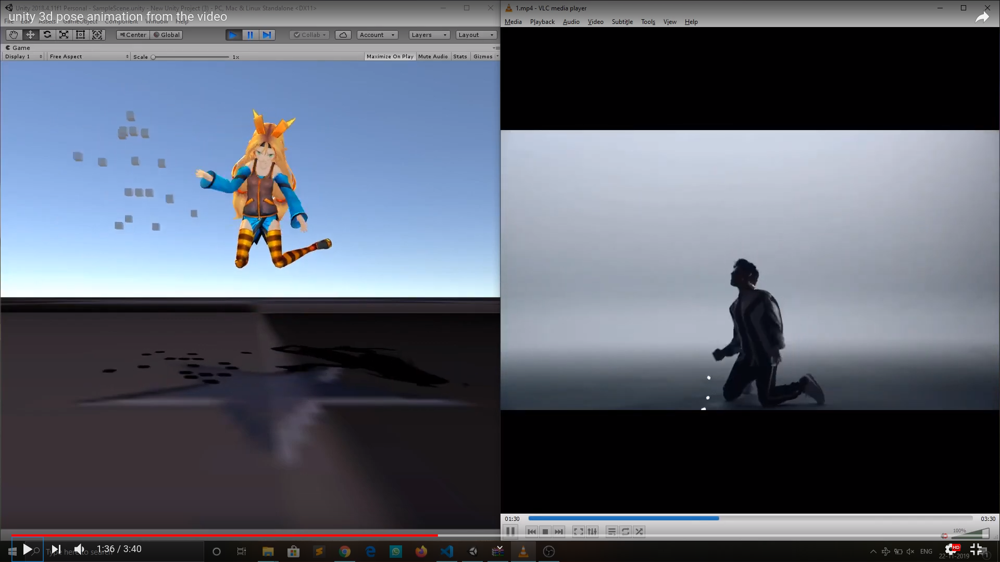
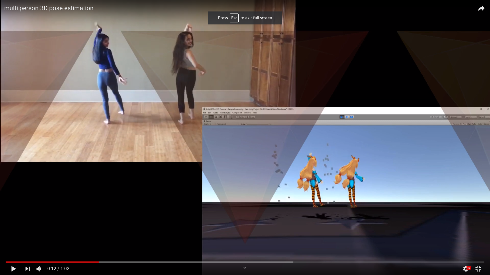
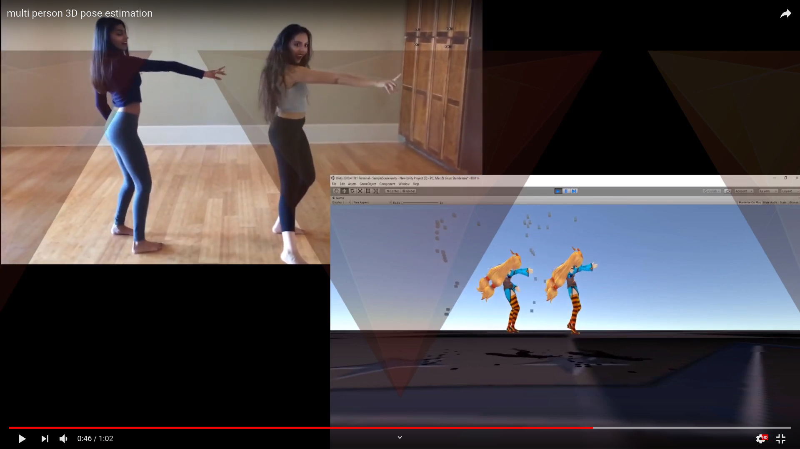
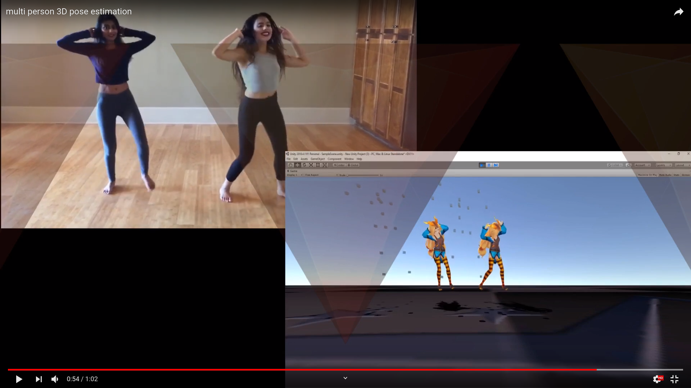

# Animepose: Multi-person 3D Pose Estimation and Animation
This repo contains application implementation of paper Animepose: Multi-person 3D Pose Estimation and Animation. Basically using this code you transfers of movement of a person from a 2d video to 3d environment in unity

# Requirements
<ol type="A">
   <li>python 3.6</li>
   <li>Tensorflow  1.12</li>
   <li>Pytorch 0.4</li>
   <li>Cuda toolkit 9.0</li>
   <li>Cudnn</li>
</ol>

# Instructions to run the code
<ol type="1">
   
<li>Download Alpha pose and set it up from the link below
   <a href="https://github.com/MVIG-SJTU/AlphaPose">Alpha Pose</a> 
   </li>
<li>Run the output of the first step through deep sort in the link below  
  <a href="https://github.com/nwojke/deep_sort">Deep Sort</a>
  </li>
<li> Segregate poses of different person using jupyter notebook code in mycode folder
</li>
<li>Uplift the poses from 2d to 3d from the below link
  <a href="https://github.com/una-dinosauria/3d-pose-baseline">3D Pose estimation Baseline</a>
 </li>
<li> Place output of the step 4 in unity assets folder and run it to watch the animation </li>
   
</ol>

# Medium Link 
## https://medium.com/@sravanvinakota/dc48cf1227f2

# Results
## Single Person 
### Demo link: https://www.youtube.com/watch?v=zhTshx-Vg_U&t=69s 

## Multi Person 
### Demo link: https://www.youtube.com/watch?v=f9cXyo3saAI 

 

